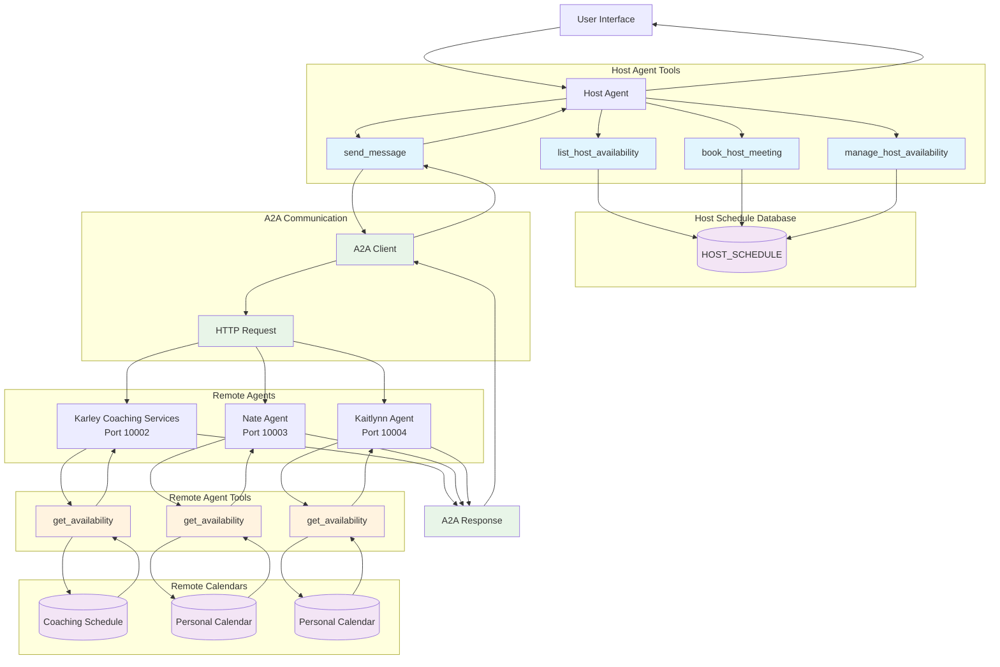
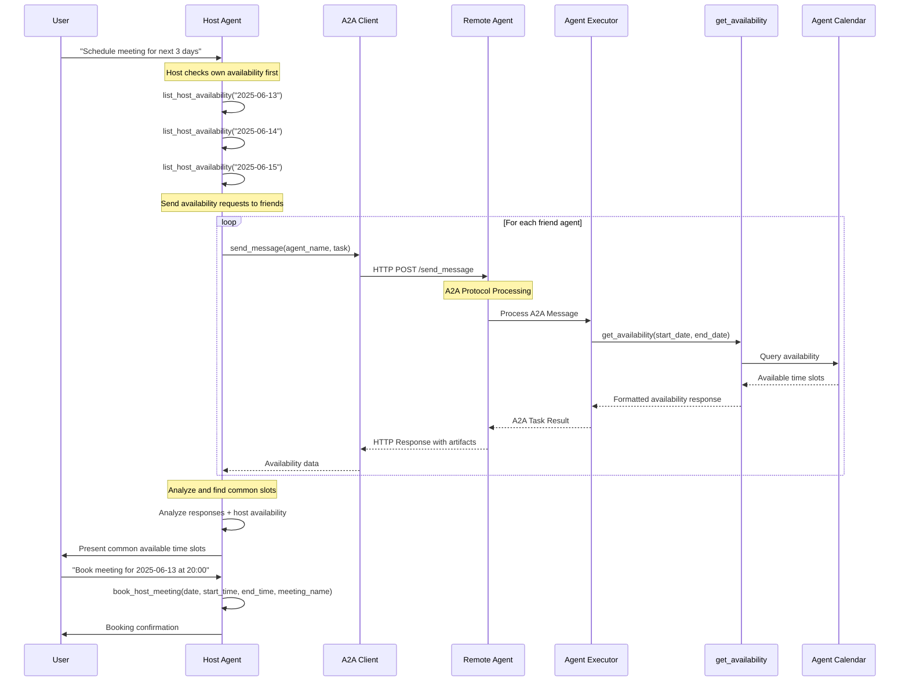
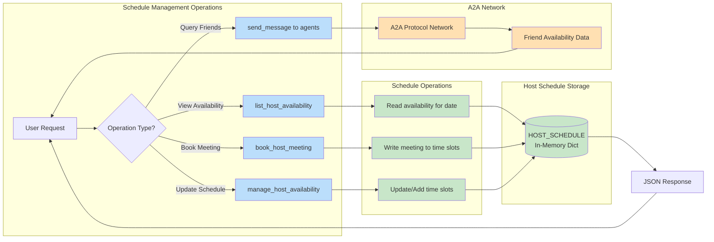
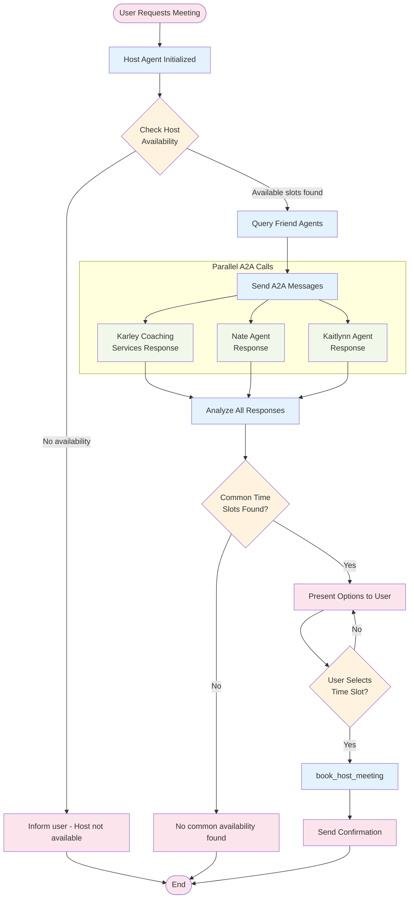

# A2A Friend Scheduling - System Architecture Diagrams

## 1. Host Agent Tools and Data Flow

## 2. A2A Protocol Communication Sequence

## 3. Host Agent Schedule Management Flow

## 4. Multi-Agent Meeting Scheduling Workflow

